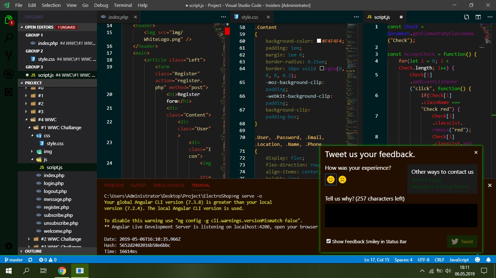

# Polska Panda Theme - VScode cookavsky
**_For Everyone, who likes green. My own theme in VScode. Change Dark (Visual Studio) in Polska-Panda-Theme._**

## Table of contents
* [Getting Started](#getting-started)
* [Screenshots](#screenshots)
* [Acknowledgments](#acknowledgments)
* [Status](#status)
* [Author](#author)

## Getting Started
I created own theme in VScode, because I did not find perfect theme. Always something did not like my. My favorite color is green, in my theme is a lot a green. It is works in my VScode Insiders, which always updates.

## Installing
Download zip, and extract. Cut folder and put in to: C:/Program Files/Microsoft VS Code Insiders/resources/app/extensions
Then turn on VScode. Open File > Preferences > Color Themes and pick your color theme.

## Technology
* Visual Studio Code - all version -

## Screenshots

## Acknowledgments
* Go to [New](./themes/new). In this file is everything describe, what I changed.

## Status
Finished.

## Author
Created by **_cookavsky_** - for friends Polska Panda.
